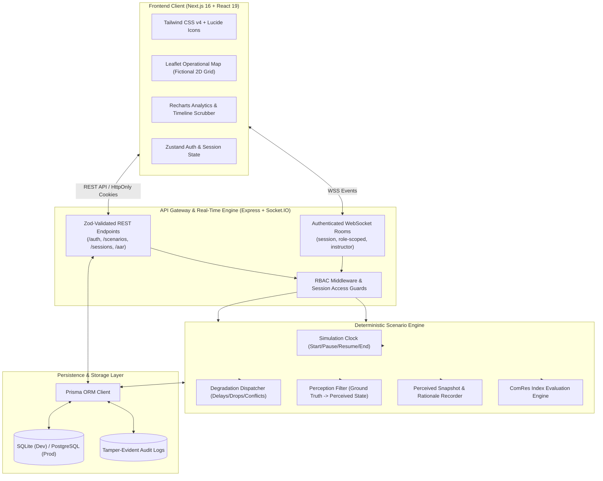

# NavDrishtiAI
> **“Train under uncertainty. Decide with confidence.”**

[](https://www.sih.gov.in/)
[](https://www.typescriptlang.org/)
[](https://nextjs.org/)
[](https://www.prisma.io/)
[](https://socket.io/)
[](#security-architecture)

---

### Safe Use Statement & Disclaimer
> **IMPORTANT SAFEGUARD NOTICE**: NavDrishtiAI uses **100% fictional, synthetic map data, generic civilian relief resources, and non-sensitive training events** (such as supply package movement through the fictional *"NavDrishti Corridor"*). It contains **no real-world weapon systems, no kinetic targeting, no classified radio frequencies, no electronic jamming hardware, no cyberattack tools, and no operational military units**. It is designed purely as an educational training simulator and serious game for high-stakes coordination under degraded communications.

---

## 1. Executive Summary & SIH26248 Problem Statement

During emergency relief, joint-agency disaster response, and high-consequence operations, communication networks are rarely reliable. Inclement weather, infrastructure failure, physical line breaks, and bandwidth congestion trigger:
- **Message delays** (e.g. status updates arriving 45+ seconds late)
- **Packet dropouts** (e.g. reconnaissance checks lost in transit)
- **Contradictory observations** (e.g. visual aerial feed vs ground sensor discrepancies)
- **Stale information** (e.g. decisions made relying on imagery that is hours old)
- **Channel outages** requiring coordinated fallback to secondary frequencies

Current training software either assumes ideal connectivity or rates student commanders unfairly: a commander who chooses a blocked route is often penalized as "incompetent," even when the status report warning of the blockage was delayed in transmission.

### The NavDrishtiAI Solution
NavDrishtiAI solves this with our core USP: **"Perception vs Ground-Truth Replay"**. The platform models both:
1. **The Ground Truth (Actual Reality)**: The true state of routes, units, hazards, and infrastructure.
2. **The Perceived Truth (Role-Scoped Reality)**: What each participant (Commander, Team Alpha, Team Bravo, Air Unit, Logistics) actually knew and saw at that exact second.

Every decision captures a cryptographic snapshot of the user's perceived state, ensuring **objective, evidence-based After-Action Reviews (AAR)** and calculating the explainable **ComRes Index (Communication Resilience Index)**.

---

## 2. Architecture & System Flow



---

## 3. Role-Based Access Control (RBAC) Matrix

| Feature / Action | `SUPER_ADMIN` | `INSTRUCTOR` | `COMMANDER` | `TEAM_OPERATOR` | `OBSERVER` |
| :--- | :---: | :---: | :---: | :---: | :---: |
| **System Settings & Health** | ✅ Full | ❌ | ❌ | ❌ | ❌ |
| **User Role & Lock Management**| ✅ Full | ❌ | ❌ | ❌ | ❌ |
| **AR/VR Waitlist Access** | ✅ View | ❌ | ❌ | ❌ | ❌ |
| **Scenario Builder & Templates** | ✅ | ✅ Full | ❌ | ❌ | ❌ |
| **Session Lifecycle (Start/Pause/End)**| ✅ | ✅ Own | ❌ | ❌ | ❌ |
| **Inject Real-Time Disruptions** | ✅ | ✅ Own | ❌ | ❌ | ❌ |
| **Full Ground-Truth Observation** | ✅ | ✅ Live | ❌ Perceived | ❌ Perceived | ❌ Perceived |
| **Issue Tactical Orders** | ❌ | ❌ | ✅ | ❌ | ❌ |
| **Acknowledge Orders** | ❌ | ❌ | ✅ | ✅ | ❌ |
| **Make Decisions & Record Rationale**| ❌ | ❌ | ✅ | ✅ Local | ❌ |
| **Transmit Field Reports** | ❌ | ❌ | ✅ | ✅ | ❌ |
| **Switch to Backup Channels** | ❌ | ❌ | ✅ | ✅ | ❌ |
| **After-Action Review (AAR) Access**| ✅ | ✅ Full | ✅ Debrief | ✅ Debrief | ✅ Read-only |
| **Export Reports (PDF/CSV/JSON)** | ✅ | ✅ | ✅ Self-scope | ❌ | ❌ |

---

## 4. Key Features

### 🌟 1. Flagship Perception vs Ground-Truth Replay
- **Timeline Scrubber**: Scrub backwards and forwards from `00:00` to `10:00` with 1x, 2x, 4x speed.
- **Side-by-Side Dual Map**: Simultaneously view actual route conditions vs what Team Alpha or the Commander saw at that exact second.
- **Delayed & Dropped Tagging**: Every transmission reflects delay latency or packet drop markers.
- **Decision Context Inspection**: Inspect the exact rationale entered by the commander and verify the age/freshness of the reports available to them at that moment.

### 📊 2. Explainable ComRes Index (Communication Resilience Index)
Evaluates 9 transparent, weighted components:
1. **Disruption Detection Speed (15%)**: Time elapsed before recognizing primary channel failure.
2. **Backup-Channel Recovery Speed (15%)**: Time required to transition to secondary frequency.
3. **Critical Order Delivery & Ack Rate (15%)**: Ratio of acknowledged tactical orders.
4. **Information Freshness Verification (15%)**: Rate of cross-verifying stale or aging observations.
5. **Conflicting-Report Resolution (10%)**: Reconciling contradictory reports before committing resources.
6. **Decision Timeliness (10%)**: Making high-consequence moves within mission windows.
7. **Team Coordination (10%)**: Cross-domain synchrony between Alpha, Bravo, Air, and Logistics.
8. **Adaptability after New Information (5%)**: Correcting route orders upon receiving delayed reports.
9. **Resource Efficiency (5%)**: Safely delivering supplies without vehicle loss or route stranding.

### 🎮 3. Default Demo Scenario: “Operation Signal Break”
- **Location**: NavDrishti Corridor (fictional relief route).
- **Mission**: Guide a supply transport from **Base Orion** to **Zone C** across North, Central, or South routes while handling injected signal delays, drone feed dropouts, and conflicting road reports.
- **Scheduled Degradations**:
  - `01:00`: Team Alpha reports North Route debris blockage.
  - `01:30`: Air Observation reports North Route clear based on older imagery.
  - `02:30`: 45-second latency delay injected on Alpha's channel.
  - `03:15`: Delayed confirmation delivered late.
  - `04:30`: Team Bravo message dropped.
  - `05:00`: Central Route slowed by synthetic weather.
  - `07:30`: Primary channel partially restores / backup channel operational.

---

## 5. Security Architecture

1. **Defense-in-Depth Authentication**:
   - Argon2id / Bcrypt password hashing.
   - 15-minute access tokens + rotating refresh tokens stored exclusively in `HttpOnly`, `SameSite=Strict` cookies (No tokens in `localStorage`).
   - RFC 6238 TOTP Two-Factor Authentication with QR setup and single-use emergency recovery codes.
   - Account lockout after 5 consecutive failed attempts (15-minute cooldown).
2. **Server-Side Authorization**:
   - Every REST endpoint and Socket.IO event enforces strict role verification.
   - Ground-truth data is stripped at the backend before emitting events to trainee rooms.
3. **Web Application Hardening**:
   - Strict Content Security Policy (CSP), X-Frame-Options, Referrer-Policy, and HSTS headers via Helmet.
   - CSRF protection for state-changing cookie transactions.
   - Rate limiting on authentication, exports, and real-time message feeds.
   - Tamper-evident Audit Logs recording all administrative, injection, and export actions.

---

## 6. Pre-Seeded Demo Accounts

All demo accounts share the development password:
```text
ChangeMe!NavDrishti2026
```

| Role | Email | Purpose |
| :--- | :--- | :--- |
| **SUPER_ADMIN** | `admin@navdrishti.local` | System stats, user management, audit logs, waitlist |
| **INSTRUCTOR** | `instructor@navdrishti.local` | Scenario builder, session injection monitor, AAR review |
| **COMMANDER** | `commander@navdrishti.local` | Issue orders, select routes, submit decision rationale |
| **TEAM_OPERATOR** | `alpha@navdrishti.local` | Team Alpha ground recon in North Corridor |
| **TEAM_OPERATOR** | `bravo@navdrishti.local` | Team Bravo ground recon in South Corridor |
| **TEAM_OPERATOR** | `air@navdrishti.local` | Aerial observation unit (imagery freshness reporting) |
| **TEAM_OPERATOR** | `logistics@navdrishti.local` | Relief supply vehicle operator |
| **OBSERVER** | `observer@navdrishti.local` | Read-only simulation and AAR monitoring |

> *Tip: The `/login` page includes 1-click **Quick-Fill buttons** for every demo role.*

---

## 7. Quick Start & Local Setup

### Prerequisites
- **Node.js**: v18.18.0 or v20.x
- **npm**: v9.x or v10.x
- **Git**

### Installation Steps

1. **Clone the repository**:
   ```bash
   git clone https://github.com/your-org/navdrishtiai.git
   cd navdrishtiai
   ```

2. **Install all dependencies (monorepo)**:
   ```bash
   npm install
   ```

3. **Configure Environment Variables**:
   Copy the example environment files:
   ```bash
   cp .env.example .env
   ```
   *(Pre-configured for local development with SQLite and local ports `3000` / `5000`)*.

4. **Initialize Database & Seed Demo Data**:
   ```bash
   cd apps/api
   npx prisma generate
   npx prisma db push
   npm run seed
   cd ../..
   ```

5. **Start Development Servers**:
   In two separate terminal windows or using background jobs:
   ```bash
   # Terminal 1 - Backend API (Port 5000)
   cd apps/api
   npm run dev

   # Terminal 2 - Next.js Web App (Port 3000)
   cd apps/web
   npm run dev
   ```

6. **Open in Browser**:
   Navigate to [http://localhost:3000](http://localhost:3000)

---

## 8. Docker Deployment

To spin up the entire application (Backend + Frontend) with a single command:

```bash
docker-compose up --build -d
```
- Web Application: [http://localhost:3000](http://localhost:3000)
- API & Realtime Gateway: [http://localhost:5000](http://localhost:5000)

---

## 9. Live Demo Walkthrough Guide

### Workflow A: Instant Flagship AAR Replay
1. Navigate to [http://localhost:3000/login](http://localhost:3000/login).
2. Click the **Instructor** Quick-Fill button and click **Sign In**.
3. On the dashboard, navigate to **AAR Reports** -> **Session ND-DEMO-AAR** (or directly [http://localhost:3000/aar/ND-DEMO-AAR](http://localhost:3000/aar/ND-DEMO-AAR)).
4. **Interact with the AAR**:
   - Scrub the timeline to `02:30` (Alpha primary delay occurs).
   - Toggle the view between **Ground Truth** and **Team Alpha View**.
   - Note the **Information Gap** callout indicating that the North Route was flagged as blocked by Alpha, but the Commander acted on stale aerial imagery.
   - Review the **ComRes Index (84/100)** score breakdown.
   - Click **Export JSON**, **Export CSV**, or **Export PDF Report**.

### Workflow B: Live Multiplayer Simulation & Injection
1. Log in as **Instructor** in one browser window and open [http://localhost:3000/session/ND-SIGNAL-88/monitor](http://localhost:3000/session/ND-SIGNAL-88/monitor).
2. In an incognito window, log in as **Commander** and open [http://localhost:3000/session/ND-SIGNAL-88/simulate](http://localhost:3000/session/ND-SIGNAL-88/simulate).
3. As the **Instructor**:
   - Press **Resume Session** to start the simulation clock.
   - In the bottom injection console, click **Inject Degradation** -> Select **Delay Messages (45s)** on **Team Alpha**.
   - Inject a **Contradictory Report** regarding route clearance.
4. As the **Commander**:
   - Notice the communication feed shows the degradation tag and stale reports.
   - Click **Make Tactical Decision**.
   - Select **Choose Route** -> Choose **Central Route**.
   - Enter decision rationale: *"North reported blocked, aerial feed stale; diverting through Central route to ensure delivery."*
   - Submit decision. The snapshot of perceived state is permanently recorded on the server.
5. In the Instructor console, click **End Exercise** to generate the real-time AAR report.

---

## 10. API Specification

| Method | Endpoint | Description | Auth Required |
| :--- | :--- | :--- | :--- |
| `POST` | `/api/auth/register` | User account registration | Public |
| `POST` | `/api/auth/login` | Email/password login with JWT & HttpOnly cookie | Public |
| `POST` | `/api/auth/2fa/verify` | Complete TOTP verification | Pre-auth token |
| `POST` | `/api/auth/refresh` | Rotate refresh token | Refresh Cookie |
| `POST` | `/api/auth/logout` | Revoke session and clear cookies | Authenticated |
| `GET`  | `/api/scenarios` | List published scenarios | Authenticated |
| `POST` | `/api/scenarios` | Create custom scenario | Instructor / Admin |
| `GET`  | `/api/sessions/:id` | Get session state and metadata | Participant |
| `POST` | `/api/sessions/:id/join` | Join training session with join code | Authenticated |
| `POST` | `/api/sessions/:id/events/inject` | Inject manual degradation event | Instructor / Admin |
| `POST` | `/api/sessions/:id/decisions` | Submit decision with rationale & perceived snapshot | Commander / Operator |
| `GET`  | `/api/sessions/:id/aar` | Retrieve After-Action Review & replay logs | Participant / Instructor |
| `POST` | `/api/sessions/:id/export/:fmt`| Export AAR as PDF, CSV, or JSON | Authenticated |
| `POST` | `/api/waitlist/ar-vr` | Register for AR/VR immersive headset waitlist | Public |

---

## 11. Testing & Validation

Run the automated integration and smoke test suite:

```bash
# Run test suite
cd apps/api
node --loader ts-node/esm ../../scripts/test-api.js
```
The test script validates:
- System health status (`/api/health`)
- Authentication flow & credential verification
- Scenario retrieval
- Session state querying (`ND-DEMO-AAR`)
- AAR report calculation and perception gap verification

---

## 12. Future Roadmap

- [ ] **WebXR / OpenXR Headset Support**: Immersive VR command room briefings with spatial audio.
- [ ] **AR Operational Overlays**: Tablet-based augmented reality map overlays for field tactical units.
- [ ] **AI-Assisted Scenario Generation**: Dynamic scenario generation adjusting communication failure probabilities based on trainee experience.
- [ ] **Tactical Air-Gapped Deployments**: Offline appliance installation for secure private institutional training facilities.

---

## 13. License & Academic Attribution
Developed as an open-source prototype for the **Smart India Hackathon (SIH26248)**. Released under the Apache 2.0 License.
